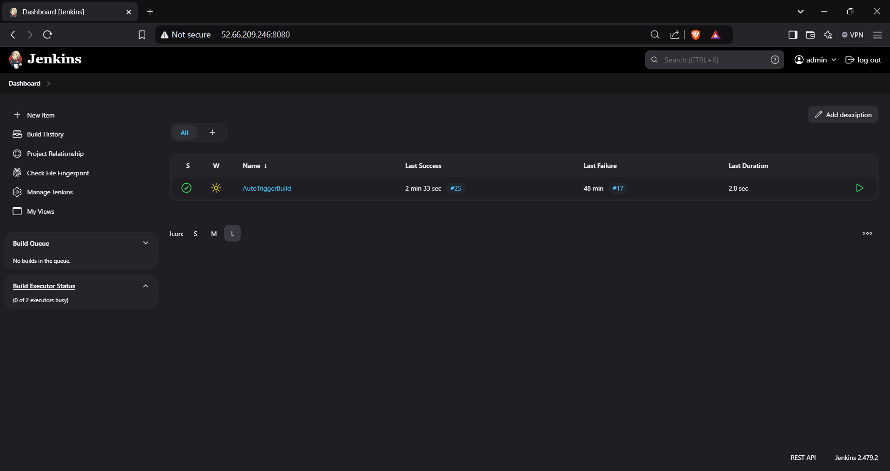
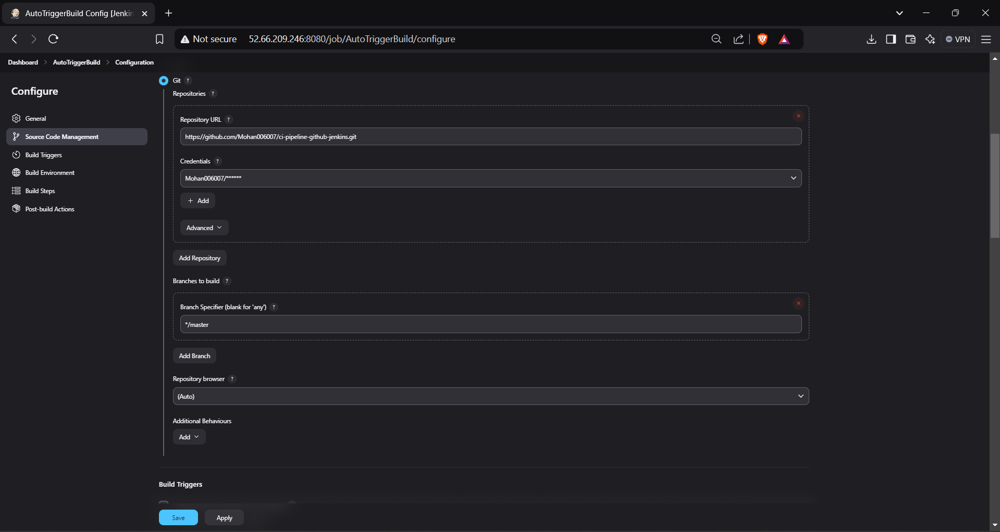
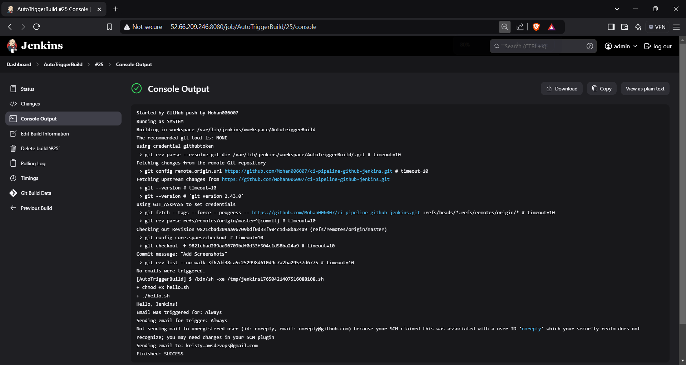
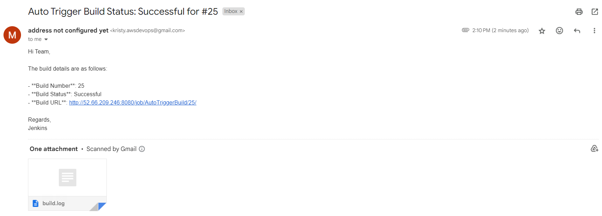

# Jenkins CI Pipeline Setup

## Overview
This repository contains the Jenkins CI/CD pipeline setup for automating the build process. The pipeline is configured to pull from a GitHub repository, trigger builds on code changes, and notify users via email on build status.

## Steps Performed

### 1. **Jenkins Job Configuration**
   I created a new Jenkins job with the following configuration:
   - **Source Code Management**: Git
     - Repository URL: `https://github.com/Mohan006007/ci-pipeline-github-jenkins.git`
     - Branch: `master`
   - **Build Triggers**:
     - Set to trigger the build on SCM changes, either by polling the SCM or using a webhook from GitHub.

### 2. **Build Step Configuration**
   The build steps are configured to:
   - Pull the latest changes from the GitHub repository.
   - Execute a shell script or build the necessary code.

### 3. **Post-Build Actions**
   The post-build actions are configured to:
   - Send email notifications on build success or failure.
     - **Recipients**: `kristy.awsdevops@gmail.com`
     - **Subject**: "Build Status: Success/Failure"
     - **Content**: Included build status and log details.

### 4. **Build Trigger**
   The build is automatically triggered when there are changes pushed to the `master` branch of the GitHub repository.

### 5. **Test and Confirmation**
   - I tested the pipeline by making a change to the GitHub repository and pushing it to the `master` branch.
   - Jenkins automatically triggered the build, and the build was successful.
   - Email notifications were successfully sent after the build.

## Screenshots
- **Jenkins Dashboard**
   
  
- **Job Configuration**
   

- **Build Output**
   

- **Email Notification**
   

## Conclusion
This setup demonstrates a fully automated Jenkins pipeline that pulls code from GitHub, runs the necessary build steps, and sends email notifications to the team on build status. The pipeline ensures quick feedback on code changes and seamless integration with GitHub.
